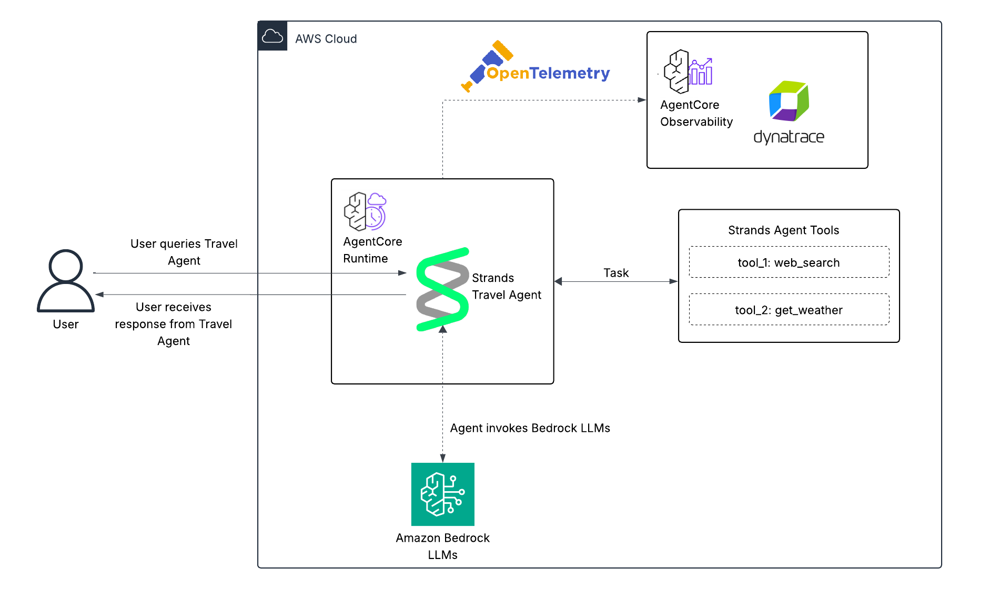
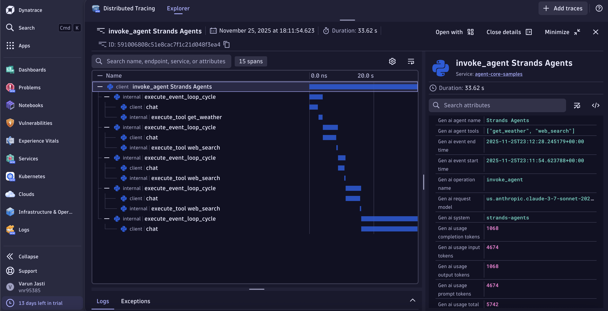
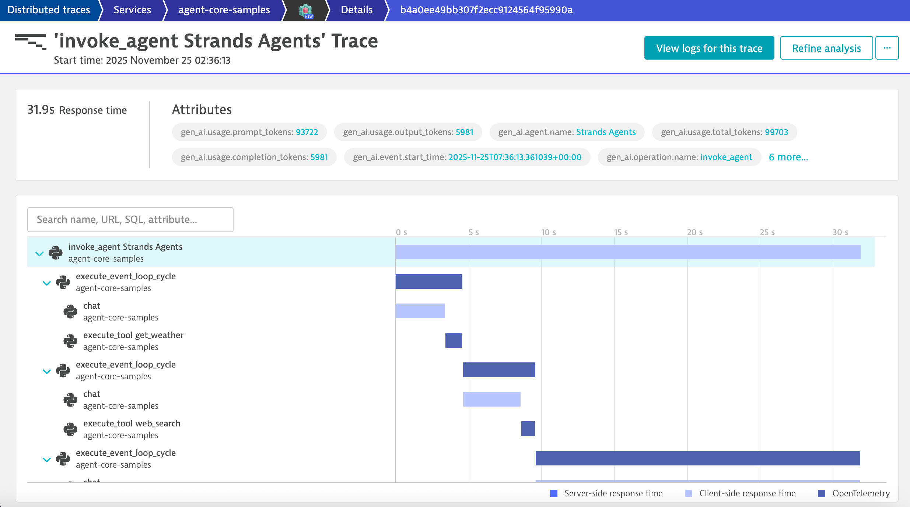

# Travel Agent Deployed on Amazon Bedrock AgentCore with Dynatrace Observability

This example demonstrates a Travel Agent built on top of [Bedrock AgentCore](https://docs.aws.amazon.com/bedrock-agentcore/latest/devguide/what-is-bedrock-agentcore.html) with full observability through Dynatrace.

## Architecture

The following diagram illustrates the architecture of the Travel Agent deployed via Bedrock Agentcore with Dynatrace observability integration:



The architecture consists of:
- **Travel Agent**: Built using Strands framework and deployed on Bedrock AgentCore runtime
- **Agent Tools**: web search and get_weather
- **Amazon Bedrock**: Provides the foundation model of choice
- **OpenTelemetry**: Captures traces, logs, and metrics from the agent
- **Dynatrace**: Receives and visualizes observability data via OTLP

## What is the Travel Agent?

The Travel Agent is an intelligent assistant designed to help users plan trips, check weather conditions and search for travel information. It leverages multiple tools to provide comprehensive travel assistance.

### Agent Capabilities

The Travel Agent is equipped with the following tools:

1. **Web Search** (`web_search`)
   - Searches the web using DuckDuckGo to find current travel information
   - Retrieves information about destinations, flights, hotels, attractions, and travel tips
   - Returns formatted results with titles, URLs, and descriptions
   - Parameters: `query` (search string), `max_results` (default: 5)

2. **Weather Information** (`get_weather`)
   - Provides real-time weather data for any location worldwide
   - Uses the Open-Meteo API for accurate weather forecasts
   - Returns temperature (actual and feels-like), weather conditions, humidity, wind speed, and precipitation
   - Parameters: `location` (city name or location)

### Example Use Cases

- "Give me suggestions for a 7 day trip to Italy in August based on what the weather is going to be like each day"
- "I'm planning a 5-day trip to Japan in spring. What's the weather forecast and what are the must-see cherry blossom spots?"
- "Help me plan a weekend getaway to Barcelona. Check the weather and recommend outdoor activities if it's sunny"
- "I have a 10-day vacation budget of $3000. Suggest destinations in Southeast Asia with good weather in December and calculate daily spending"
- "What is the weather like in Iceland right now? Should I visit the Blue Lagoon today or wait for better conditions?"

## Prerequisites

- Python 3.9 or higher
- Dynatrace Account
- AWS Account with appropriate permissions
- Access to the following AWS services:
   - Amazon Bedrock

## Dynatrace Instrumentation

> [!TIP]
> For detailed setup instructions, configuration options, and advanced use cases, please refer to the [Get Started Docs](https://docs.dynatrace.com/docs/shortlink/ai-ml-get-started).

Bedrock AgentCore comes with [Observability](https://docs.aws.amazon.com/bedrock-agentcore/latest/devguide/observability.html) support out-of-the-box.
Hence, we just need to register an [OpenTelemetry SDK](https://github.com/open-telemetry/opentelemetry-specification/blob/main/specification/overview.md#sdk) to send the data to Dynatrace AI Observability.

We simplified this process, hiding all the complexity inside [dynatrace.py](./dynatrace.py).
For sending data to your Dynatrace tenant, you can configure the `OTEL_ENDPOINT` env var with your Dynatrace URL for ingesting [OTLP](https://docs.dynatrace.com/docs/shortlink/otel-getstarted-otlpexport), for example: `https://wkf10640.live.dynatrace.com/api/v2/otlp`.

The API access token will be read from your filesystem under `/etc/secrets/dynatrace_otel` or from the environment variable `DT_TOKEN`.

## How to use

### Setting your AWS Credentials

#### Step 1: Create AWS Access Keys

1. Sign in to the [AWS Management Console](https://console.aws.amazon.com/)
2. Navigate to **IAM** (Identity and Access Management)
3. In the left navigation pane, select **Users**
4. Select your IAM user name (or [create a new user](https://docs.aws.amazon.com/IAM/latest/UserGuide/id_users_create.html) if needed)
5. Select the **Security credentials** tab
6. Under **Access keys**, select **Create access key**
7. Choose **Command Line Interface (CLI)** as the use case
8. Check the confirmation box and select **Next**
9. (Optional) Add a description tag for the access key
10. Select **Create access key**
11. **Important**: Copy both the **Access key ID** and **Secret access key** immediately - you won't be able to see the secret key again

#### Step 2: Configure AWS Credentials

Run the following command:

```bash
aws configure
```

When prompted, enter:
- AWS Access Key ID: `your_access_key_id`
- AWS Secret Access Key: `your_secret_access_key`
- Default region name: `us-east-1` (or your preferred region)
- Default output format: (press enter and leave it default or set it per your perference)

#### Step 3: Configure IAM Permissions

Ensure your IAM user has the necessary permissions. Follow the [Amazon Bedrock AgentCore documentation](https://docs.aws.amazon.com/bedrock-agentcore/latest/devguide/runtime-permissions.html) to attach the required policies.

### Setting your Dynatrace Token

Create a [Free Dynatrace Trial](https://www.dynatrace.com/signup/) for 15 days.
After a few minutes, you will get redirected to your tenant. The URL will look like `https://wkf10640.apps.dynatrace.com/`.
The value in your URL in place of `wkf10640` is your environment id which will be needed later.

After that, you can create an Access Token:

1. In Dynatrace, go to **Access Tokens**. To find **Access Tokens**, press **Ctrl/Cmd+K** to search for and select **Access Tokens**.
2. In **Access Tokens**, select **Generate new token**.
3. Enter a **Token name** for your new token.
4. Give your new token the following permissions:
5. Search for and select all of the following scopes.
    * **Ingest OpenTelemetry traces** (`openTelemetryTrace.ingest`)
    * **Ingest logs** (`logs.ingest`)
    * **Read metrics** (`metrics.read`)
6. Select **Generate token**.
7. Copy the generated token to the clipboard. Store the token in a password manager for future use.

Afterwards, you can set your Dynatrace information in your environment variables by running the following command in your terminal:

```bash
export DT_TOKEN=your_access_token
export OTEL_ENDPOINT=https://{your-environment-id}.live.dynatrace.com/api/v2/otlp
```

Replace `{your-environment-id}` with your actual Dynatrace environment ID (e.g., `wkf10640`).

### Install Dependencies

Install the required dependencies using uv:

```bash
uv sync
```

### Run the app

Start the Travel Agent with the following command:

```bash
uv run main.py
```

This will create an HTTP server that listens on port `8080` and implements the required `/invocations` endpoint for processing the agent's requests.

### Interact with the Travel Agent

You can interact with your Travel Agent using curl commands:

**Plan a multi-day trip with weather considerations:**
```bash
curl -X POST http://127.0.0.1:8080/invocations \
  --data '{"prompt": "Give me suggestions for a 7 day trip to Italy in August based on what the weather is going to be like each day"}'
```

**Get weather-based activity recommendations:**
```bash
curl -X POST http://127.0.0.1:8080/invocations \
  --data '{"prompt": "Help me plan a weekend in Barcelona. Check the weather and recommend outdoor activities if it is sunny"}'
```

**Plan a trip with budget calculations:**
```bash
curl -X POST http://127.0.0.1:8080/invocations \
  --data '{"prompt": "I have a 10-day vacation budget of $3000. Suggest destinations in Southeast Asia with good weather in December and calculate daily spending"}'
```

**Check current weather for travel decisions:**
```bash
curl -X POST http://127.0.0.1:8080/invocations \
  --data '{"prompt": "What is the weather like in Iceland right now? Should I visit the Blue Lagoon today or wait for better conditions?"}'
```

**Seasonal trip planning:**
```bash
curl -X POST http://127.0.0.1:8080/invocations \
  --data '{"prompt": "I am planning a 5-day trip to Japan in spring. What is the weather forecast and what are the must-see cherry blossom spots?"}'
```

### Deployment

The Agent is now ready to be deployed. The best practice is to package the code as a container and push to ECR using CI/CD pipelines and IaC. 
You can follow the guide 
[here](https://github.com/awslabs/amazon-bedrock-agentcore-samples/blob/main/01-tutorials/01-AgentCore-runtime/01-hosting-agent/01-strands-with-bedrock-model/runtime_with_strands_and_bedrock_models.ipynb) 
for a full step-by-step tutorial.

## Observability in Dynatrace

Now you have full observability of your Bedrock AgentCore Agents in Dynatrace!

You can view detailed traces, metrics, and logs for your Travel Agent:


